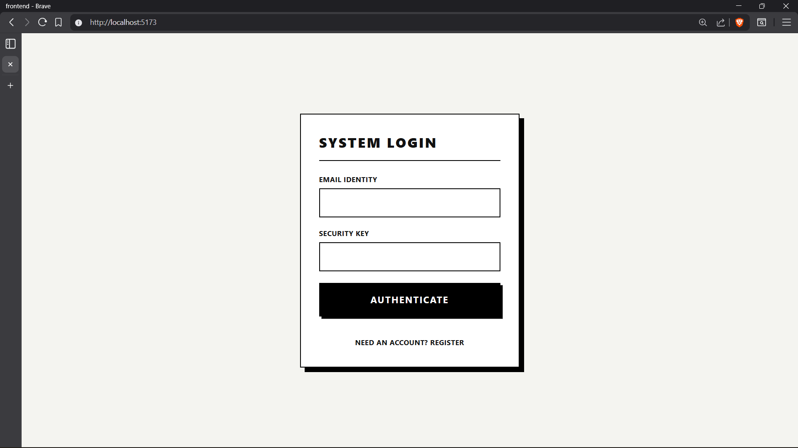
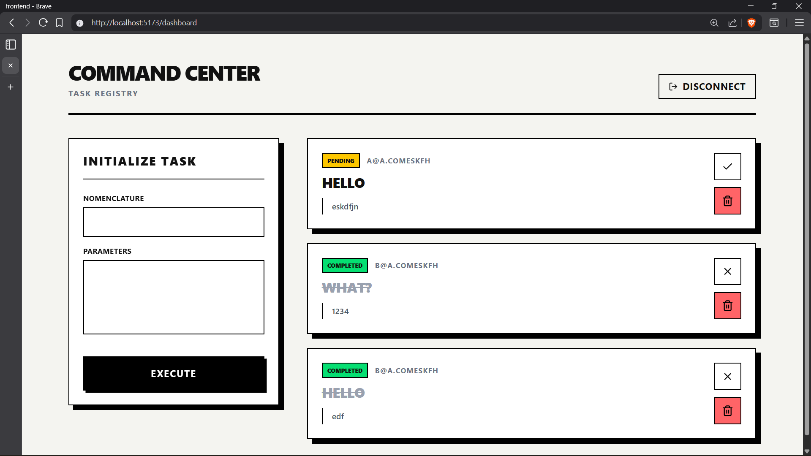

# PrimeTrade Task Registry System

A secure, full-stack task management REST API with an interactive React client — built for the PrimeTrade.ai Developer Intern assessment.

**Author:** Priyanshu Gaurav

---

## Screenshots

**Auth**


**Dashboard**


---

## Architecture

### Backend — Node.js / Express / MongoDB
- **Auth:** JWT + `bcryptjs` password hashing
- **Access Control:** RBAC middleware — `USER` (own data) vs `ADMIN` (global access)
- **Security:** `helmet` for request sanitization
- **Database:** MongoDB via Mongoose with strict schemas

### Frontend — React / Vite / TailwindCSS
- Minimalist, responsive interface with full CRUD and real-time feedback
- Secure JWT handling via Axios interceptors

---

## Setup

> Requires Node.js, npm, and MongoDB (local or remote URI).

**1. Create `/backend/.env`**

```env
PORT=5000
MONGO_URI=mongodb://localhost:27017/primetrade_tasks
JWT_SECRET=your_secure_random_string
```

**2. Start the backend**

```bash
cd backend && npm install && npm run dev
```
API live at `http://localhost:5000`

**3. Start the frontend** *(new terminal)*

```bash
cd frontend && npm install && npm run dev
```
Client live at `http://localhost:5173`

---

## API Reference

| Method | Route | Auth | Description |
|---|---|---|---|
| `POST` | `/api/v1/auth/register` | Public | Register a new user |
| `POST` | `/api/v1/auth/login` | Public | Login, returns JWT |
| `GET` | `/api/v1/tasks` | User/Admin | List tasks |
| `POST` | `/api/v1/tasks` | User/Admin | Create a task |
| `PUT` | `/api/v1/tasks/:id` | User/Admin | Update a task |
| `DELETE` | `/api/v1/tasks/:id` | User/Admin | Delete a task |

---

## Testing

Import `/backend/postman_collection.json` into Postman. Run **Login User** — the JWT is auto-extracted and set as an environment variable, so all protected routes work immediately.